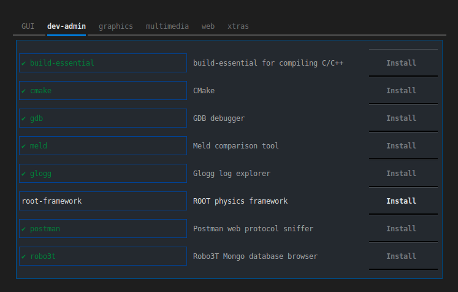

# SuperPack

[](https://github.com/psf/black)
[](https://www.debian.org/)
[](https://www.microsoft.com/en-us/software-download/windows10%20)
[](https://www.apple.com/macos/)
[](https://www.gnu.org/software/bash/)
[](https://github.com/PowerShell/PowerShell)


This is a custom package management and bundled installation utility for all desktop platforms. If you find yourself installing the same sets of software on every machine, this, in conjunction with something like [dotbot](https://github.com/anishathalye/dotbot/) might be the right solution for you. Which is [exactly](https://github.com/martukas/dotfiles) how I use it.



---

- [Rationale](#rationale)
- [Limitations](#limitations)
- [Running](#running)
- [Package definitions](#package-definitions)
- [Examples](examples)
- [Implementation](#implementation)
- [Contributing](#contributing)

---

## Rationale

This solves my particular use case:
* installing same or similar sets of programs on fresh machines
* dealing with different package managers, such as `apt`, `snap`, `winget`, with subtly different syntax, and not caring to remember which package resides where
* the need to occasionally build and install from source, with custom configurations rather than using existing packages
* something like Ninite seems outdated and does not provide many programs I need
* should work on both Linux and Windows
* sometimes need to do this in CLI only, e.g. on a remote machine, without a window manager
* I want to curate my own list of programs I will likely need, and keep them categorized in my own way
* Increasing overlap in configurations across OSs, in particular with ssh, git and Windows Linux Subsystem, makes it increasingly convenient to maintain a common bootstrapper for packages as well
* Something like Ansible is too steep a learning curve and might feel like driving a tank to pick up a gallon of milk


## Limitations

It does NOT in any way adapt packages from one OS to another.

It does NOT provide any all-encompassing repository nor does it search the wrapped repositories for existing packages.  It's your responsibility to find the packages you need and describe them in your own manifest.

Currently, this utility is only adapted for and tested on Ubuntu and Windows 10, but the architecture should be flexible enough to add handlers for other systems and package managers with minimal modification.

### Linux

This has only been tested on Xubuntu 22.04LTS and 22.10. The included handlers should work fine with any Debian-based distro that uses the `apt` package manager.

### Windows

This has only been tested on Windows 10 with [PowerShell Core 7](https://github.com/PowerShell/PowerShell) and the [winget](https://winget.run/) package manager.

To begin using this utility on Windows you will first need to:
* Run `Set-ExecutionPolicy RemoteSigned` to allow the running of `ps1` scripts
* Install most recent PowerShell with `winget install -e --id Microsoft.PowerShell`

### macOS

Not tested on macOS, but it should be pretty easy to make a handler for `brew`. Help needed.

## Running

First run `pipenv install` to get dependencies.

You may test it out with the minimal example manifests included in this repo.

**On Linux**
```shell
pipenv run python ./superpack/superpack.py ./examples/ubuntu.yml
```

**Io Windows 10**
```powershell
pipenv run python .\superpack\superpack.py .\examples\win10.yml
```

If you try to run this from something like ConEmu, the UI library may not render correctly, so it's recommended you run it from a vanilla `pwsh` terminal. If you need to integrate this command into some install script that you might run from funky places, you can always force the creation of a new PowerShell windows with something like this:
```powershell
Start-Process pwsh -ArgumentList `
"-Command & {pipenv run python ./superpack/superpack.py .\examples\win10.yml}"
```

### Options

In addition to the manifest path, you may also add the following keywords to run it with special debug behavior:
* `read` - will only read the manifest and quit immediately, just to test the parsing
* `-f` - will force the HandlerWrapper to load all package handlers, including ones not compatible with the detected OS
* `check` - will load the manifest and check for the installation status of all packages and then quit immediately, without running the UI

## Package definitions

You should create a YAML file with your package definitions like the ones found in the [examples](examples) directory. For example:

```yaml
- packages:
    - id: firefox
      descr: Firefox browser
      category: web
      type: snap
    - id: dummy
      descr: Dummy test package
      category: xtras
      type: posix
      check: which nonexistentscript
      install: "./examples/custom.sh test"
```

### id

The identifier should be unique, and in case of packages that are wrappers/references to other package management systems, this "id" should be the actual package name. This will save you the time and effort of having to write boilerplate "check" and "install" commands, as those will be generated for you.

### descr

Description field. Make this informative and useful.

### category

Category for sorting the packages into tabs in the UI. Watch out for escape characters that may trip up the UI library.

### type
This should be one of the valid `MetaPackage.Type` Enum values, which at this time is one of:
* posix
* powershell
* apt
* snap
* winget

For the 2 shell types - "posix" and "powershell" - the values of `check` and `install` will be used as commands with an invocation of the appropriate shell. Avoid multi-line commands. Instead, create a custom shell script, like the ones you see under [examples](examples).

For the wrapped package managers - "apt", "snap" and "winget" - the `id` field will be used with boilerplate check and installation commands. If there are additional steps on top of the expected standard installation method, you may also provide an additional script to run in `install`, which the particular handler will run afterwards. Otherwise, `install` may be omitted.

### check

This will only be run for "posix" and "powershell" packages, so it should be used for custom packages installed with scripts. The command should answer whether the said package has been installed. This could be a check for the presence of an executable, or anything that you consider good evidence.
* If the package is PRESENT, the script should return a NON-EMPTY string
* if the package is NOT present, it should return an EMPTY string.

### install

Commands in this field will be run when attempting to install the package. This script will always be run for "posix" and "powershell" types. For types referencing existing package management systems, it will be run if non-empty, and will be delegated to the "parent" shell handler, i.e.
* apt -> posix
* snap -> posix
* winget -> powershell

### sections and defaults

The YAML file may consist of any number of sections, each with a `packages:` array and optionally a `defaults:` definition, which can define a template for all the packages in that section. For example:

```yaml
- defaults:
    type: apt
    category: dev-admin
  packages:
  - id: build-essential
  - id: remmina
    descr: Remmina remote desktop client
```

This will create 2 packages, both of which will be installed with "apt" and both will belong to the "dev-admin" category. Their id's will differ. One of them also ommits the `descr` field. Each individual package definition in the section can still override the defaults, but this might make reading and maintaining it more confusing. Sections and defaults allow for more concise manifests.


## Implementation

I am mainly using [textual](https://github.com/textualize/textual/) for the UI, and a bit of [rich](https://github.com/Textualize/rich) for debug output.

## Contributing

New features will be implemented as I personally find need for them. Help is welcome.

Please install [pre-commit](https://pre-commit.com/) on your system and run this in the repo:
```shell
pre-commit install
```

<details>
<summary>Roadmap</summary>

* make uninstall/remove possible
* install multiple packages at once, after marking them as targets in UI
Here are some features/ideas I would like to implement if I ever get around to it:
* Function to update/upgrade some or all packages
* More and better keybindings
* Unit tests
* make sure this deploys as proper Python package
* one package definition can reference multiple alternative managers, so that e.g. one manifest can be kept for all possible systems. Not sure this is needed.
* Handlers for macOS
* Handlers for other Linux distros
</details>
